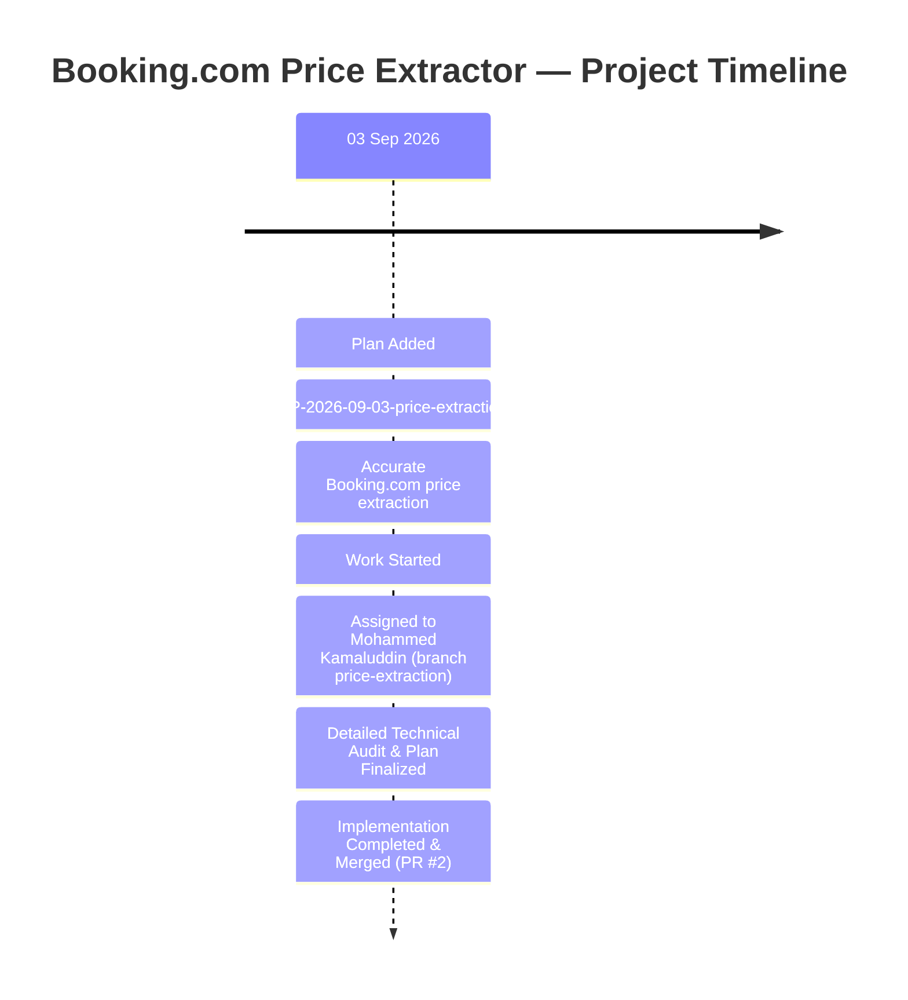

# 📊 Future Plan Timeline

An append-only history of planning, developer assignments, progress updates, and completion events for the `future-plan` branch.

Dates use the `D MMM YYYY` format (e.g. `03 Sep 2026`). Every entry links to a Plan ID in [FUTURE_PLAN.md](./FUTURE_PLAN.md).

---

## 📈 Visual Project Timeline

---

## 📜 Timeline Event Log

| Date | Plan ID | Event | Status | Assignee / Developer | Notes |
| --- | --- | --- | --- | --- | --- |
| 03 Sep 2026 | [FP-2026-09-03-price-extraction](./FUTURE_PLAN.md#fp-2026-09-03-price-extraction-—-accurate-bookingcom-price-extraction) | Plan Added | 🟡 Planned | Unassigned | Defined scope for search-context-specific Booking.com price extraction. |
| 03 Sep 2026 | [FP-2026-09-03-price-extraction](./FUTURE_PLAN.md#fp-2026-09-03-price-extraction-—-accurate-bookingcom-price-extraction) | Work Started | 🔵 In Progress | Mohammed Kamaluddin | Work started on implementation branch `price-extraction`. |
| 03 Sep 2026 | [FP-2026-09-03-price-extraction](./FUTURE_PLAN.md#fp-2026-09-03-price-extraction-—-accurate-bookingcom-price-extraction) | Daily Commitment / Progress | 🔵 In Progress | Mohammed Kamaluddin | Deep technical audit completed (7 risk areas) and detailed implementation plan integrated into `FUTURE_PLAN.md`. |
| 03 Sep 2026 | [FP-2026-09-03-price-extraction](./FUTURE_PLAN.md#fp-2026-09-03-price-extraction-—-accurate-bookingcom-price-extraction) | Implementation Completed | 🟢 Completed | Mohammed Kamaluddin | PR #2 `Price extraction (#2)` merged into `main` with 100% Vitest and Playwright test coverage. |
| 03 Sep 2026 | [FP-2026-09-03-price-extraction](./FUTURE_PLAN.md#fp-2026-09-03-price-extraction-—-accurate-bookingcom-price-extraction) | Plan Completed | 🟢 Completed | Mohammed Kamaluddin | Search-context-specific room price extraction feature fully integrated into `main`. |

---

## 🔄 Timeline Event Lifecycle & Guidelines

When a new event occurs, append a new row to the **Visual Project Timeline** diagram and the **Timeline Event Log** table using one of the following lifecycle stages:

1. **Plan Added** — Logged when a new plan is added to [FUTURE_PLAN.md](./FUTURE_PLAN.md).
2. **Work Started** — Logged when a developer is assigned and starts implementation work on a feature branch.
3. **Daily Commitment / Progress** — Logged for day-to-day developer progress, milestones, or blockers.
4. **Implementation Completed** — Logged when implementation and PR testing are finished.
5. **Plan Completed** — Logged when changes are verified and merged into `main`.
