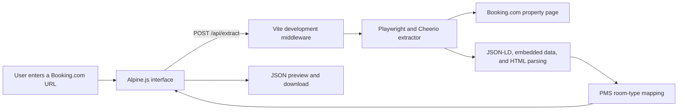

# Booking.com Hotel Data Extractor and PMS Mapper

A development-only web application that uses Playwright and Cheerio to extract selected hotel information from a Booking.com property page and transform it into `pms_roomtype`-style records.

It provides a browser interface for submitting a Booking.com URL, reviewing the resulting hotel, room, photo, and facility data, and downloading the generated JSON.

> [!IMPORTANT]
> This is a development tool. The extraction endpoint is implemented as Vite development-server middleware, so a static production build does **not** include a working `/api/extract` backend.

## Features

- Opens Booking.com property pages in headless Chromium so JavaScript-rendered content can be inspected.
- Extracts hotel metadata, room types, occupancy, bed details, photos, and facilities from JSON-LD, embedded page data, and HTML.
- Maps extracted data to a `PMSRoomTypeRecord` structure suitable for a `pms_roomtype` import workflow.
- Displays extracted data in an Alpine.js interface with overview, rooms, photos, facilities, and JSON views.
- Downloads the generated records as `pms_hotel_extracted_data.json`.
- Tracks which output fields were dynamically extracted and which use defaults.

## Current limitations

- Booking.com can change its markup, require verification, limit access, or return content that is unavailable to automated browsers. A successful result is not guaranteed.
- Room rates are not yet reliably extracted. When a rate is not found, the current implementation uses the fallback value `200`; do not treat that value as a live price.
- The extractor requires a Booking.com URL. Dates, guest count, and currency are not yet part of the request model; these inputs are required for dependable rate collection.
- The API is available only while the Vite development server is running. `npm run build` produces static frontend files without the extraction API.

See [FUTURE_PLAN.md](./FUTURE_PLAN.md) for the planned work to make room-price extraction accurate and search-context-specific.

On the `future_plan` branch, [FUTURE_TIMELINE.md](./FUTURE_TIMELINE.md) records each plan addition, start, implementation, and completion using `D MMM YYYY` dates.

## Technology

| Area | Tool |
| --- | --- |
| Frontend | Alpine.js, Tailwind CSS |
| Development server | Vite |
| Page rendering | Playwright Chromium |
| HTML parsing | Cheerio |
| Language | TypeScript |

## Architecture



## Requirements

- Node.js 18 or later
- npm 9 or later
- Playwright Chromium browser binaries

## Setup

Clone the repository and enter the project directory:

```bash
git clone <repository-url>
cd extract_data_bookingcom
```

Install JavaScript dependencies:

```bash
npm install
```

Install the Playwright Chromium binary:

```bash
npx playwright install chromium
```

## Run locally

Start the development server:

```bash
npm run dev
```

The default development server port is `3001`, configured in [vite.config.ts](./vite.config.ts). Open:

```text
http://localhost:3001/exract_data_bookingcom/
```

> The configured base path contains `exract_data_bookingcom` to match the current Vite configuration. If port `3001` is already in use, change the `server.port` value in `vite.config.ts` and use the corresponding local URL.

## How to use the interface

1. Start the development server.
2. Open the local URL in a browser.
3. Paste a Booking.com property URL, or use the preset URL.
4. Select **Extract Data**.
5. Review the Overview, Room Types, Photos, Facilities, and Raw JSON tabs.
6. Use **Download JSON** or **Copy JSON** to export the results.

## Development API

The Vite development server exposes one endpoint:

```text
POST /api/extract
Content-Type: application/json
```

Request body:

```json
{
  "url": "https://www.booking.com/hotel/au/renmark-motor-inn.en-gb.html"
}
```

The response is a JSON array of PMS room-type records. A shortened example is:

```json
[
  {
    "roomtype_hotel_name": "Renmark Motor Inn",
    "roomtype_name": "Standard Double Room",
    "roomtype_code": "SDR",
    "roomtype_max_sleeps": 2,
    "roomtype_rack_rate": 200,
    "roomtype_photos": [],
    "_field_sources": {
      "dynamic_fields": ["roomtype_name"],
      "default_fields": ["roomtype_rack_rate (default 200)"]
    }
  }
]
```

The example rate is intentionally marked as a default. Check `_field_sources` before considering a field to be live extracted data.

### API errors

| Status | Meaning |
| --- | --- |
| `400` | The request body does not include a valid string `url`. |
| `405` | The endpoint was called with a method other than `POST`. |
| `500` | The page could not be loaded or the extraction failed. |

## Extracted data and defaults

The extractor attempts to obtain the following data from the page:

- Hotel name, description, address, review rating, and review count
- Room names, selected bed details, and occupancy
- Property and room-associated image URLs
- Facilities grouped into readable categories

Some PMS fields are generated or defaulted. Notable examples are:

| Field | Current behavior |
| --- | --- |
| `roomtype_code` | Generated from the room name. |
| `roomtype_num_rooms` | Defaults to `1`. |
| `roomtype_num_bedrooms` | Defaults to `1`. |
| `roomtype_rack_rate` | Uses a parsed page price when available; otherwise defaults to `200`. |
| `roomtype_min_rate` / `roomtype_max_rate` | Default to `-1`. |
| `roomtype_max_child` | Defaults to `0`. |
| `roomtype_category` | Defaults to `Standard`. |

For a complete field-level indication, inspect each record’s `_field_sources` object.

## Build

Run the TypeScript check and create the static frontend bundle:

```bash
npm run build
```

The files are written to `dist/`. They can host the interface, but they cannot run the Playwright extractor by themselves. Deploy the extraction code as a separate server-side API before using this project in production.

## Testing

Type-check the project without writing output:

```bash
./node_modules/.bin/tsc --noEmit
```

For a manual live test, run the development server and submit:

```text
https://www.booking.com/hotel/au/renmark-motor-inn.en-gb.html
```

A development test on this URL returned the hotel name, five room types, room photos, and facilities. Its room rates used the `200` fallback, which is expected under the current limitation described above.

## Repository structure

```text
.
├── .gitignore
├── FUTURE_PLAN.md
├── FUTURE_TIMELINE.md
├── README.md
├── index.html
├── inspect_scrolled.js
├── package.json
├── tsconfig.json
├── vite.config.ts
└── src/
    ├── main.ts
    ├── style.css
    └── utils/
        └── bookingExtractor.ts
```

## Repository hygiene

The included [.gitignore](./.gitignore) excludes dependencies, build output, local environment files, credential-like files, logs, page dumps, browser test output, and editor-specific files.

Do not commit Booking.com page captures, API keys, `.env` files, downloaded browser binaries, or generated extraction output unless they have been reviewed and are intentionally safe to share.

## Responsible use

Use this tool only for pages and data you are permitted to access. Respect Booking.com’s terms, applicable law, rate limits, and any access controls. Do not rely on the extracted output as an authoritative source without validating it for the relevant dates, guests, currency, and property.
