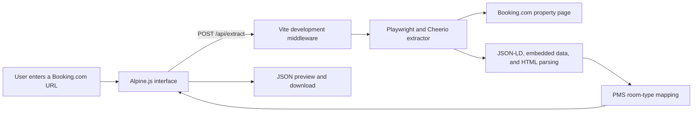

# 📌 Project Planning & Roadmap (`future-plan` branch)

> [!IMPORTANT]
> **Documentation-Only Branch**  
> This branch (`future-plan`) is used **ONLY** for project planning, future tasks, timelines, developer progress tracking, and update history.  
> It does **NOT** contain the application's source code.

---

## 💻 Application Code Location

- The actual application source code, build configuration, and development environment are maintained on the [`main`](https://github.com/kamal-u247/extract_data_bookingcom/tree/main) branch and feature-specific branches (e.g. `feature/*`, `fix/*`).
- **To view or work on the application code**, switch to the `main` branch:
  ```bash
  git checkout main
  ```

---

## 📚 Planning Documents & Structure

This branch contains the following project management documents:

1. [**FUTURE_PLAN.md**](./FUTURE_PLAN.md) — Central registry and backlog for planned features, upcoming improvements, technical tasks, bugs/issues to address later, priorities, status, developer assignments, and definitions of done.
2. [**FUTURE_TIMELINE.md**](./FUTURE_TIMELINE.md) — Visual Mermaid timeline diagram and chronological append-only log tracking plan additions, developer assignments, day-to-day commitments, implementation completion, and merge history.

---

## ⚙️ Branch Policy & Workflow Rules

1. **No Application Source Code**: Do not commit application code, build files, or node dependencies (`src/`, `package.json`, `vite.config.ts`, etc.) to this branch.
2. **Branching Strategy**:
   - Feature development must start from `main` (e.g. `git checkout -b feature/my-feature main`).
   - Planning updates, roadmaps, and timeline logs are committed directly to `future-plan`.
3. **Adding New Plans**: When a new plan is introduced, add it to `FUTURE_PLAN.md` and append a corresponding `Plan Added` entry in `FUTURE_TIMELINE.md`.
4. **No Merging to Main**: Do NOT merge `future-plan` into `main`. `future-plan` exists strictly as a lightweight documentation branch.

---

## 🔍 Overview of the Application (Main Branch Reference)

For reference, the application maintained on `main` is a **Booking.com Hotel Data Extractor and PMS Mapper** built with Playwright Chromium, Cheerio, TypeScript, Alpine.js, and Vite.

### Architecture Overview



To run the application, install dependencies, or read complete technical implementation details, please switch to the `main` branch.
